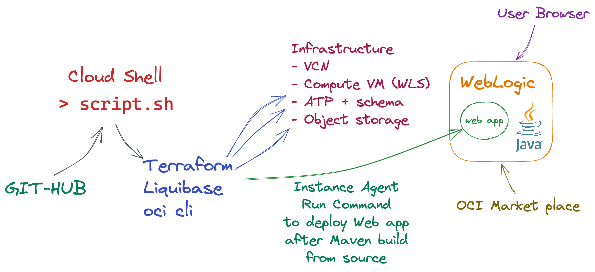

### Demo - Deploying WebLogic from OCI Marketplace UCM image with ATP using oci cli and Terraform in OCI cloud shell including maven build from source. Includes DB schema creation in Terraform with Liquibase.

    

Deploying ATP to a <i>private</i> subnet instead of public in this <a href="https://github.com/mikarinneoracle/weblogic-atp-terraform-demo/tree/weblogic-with-ATP-in-private-subnet">branch</a>. (Excludes the Terraform Liquibase part.)
    
## Instructions

<i>prereq: oci cli must be working in oci cloud shell</i>.

Open oci cloud shell

Run <code>git clone https://github.com/mikarinneoracle/weblogic-atp-terraform-demo.git</code>

Edit <code>script.sh</code> with oci code editor 
    => add your oci compartment by replacing <i>&lt;YOUR COMPARTMENT OCID&gt;</i> and the <i>region</i> if necessary (<a href="script.sh#L1-L2">lines 1-2</a>):

<pre>
compt_ocid='&lt;YOUR COMPARTMENT OCID&gt;'
region="eu-amsterdam-1"
</pre>

    Optionally can add your <code>public ssh key</code> by replacing <i>&lt;YOUR OPTIONAL SSH KEY&gt;</i> in the <code>script.sh</code> (<a href="script.sh#L3">line 3</a>):

<pre>
sshKey="&lt;YOUR OPTIONAL SSH KEY&gt;"
</pre>    

<i>Note</i>: Just make sure you are running the Cloud Shell in the <i>same region</i> as this one.

Run 
<pre>
    sh script.sh
</pre>

Using Terraform the script will create a "weblogic-VCN" and a compute VM instance "webLogic" from <b>Marketplace UCM image</b> adding it to the VCN public subnet. Terraform will also create autonomous database Weblogic-ATP" with Internet access and adds a custom schema to it. Finally it will do a maven build from source <code>app</code> then and install the built WebLogic sample <code>app.war</code> on the VM using <b>instance-agent</b>.
    
<i>Note:</i> To make the <code>VM instance-agent</code> run succesfully add the following <code>policy</code> to
the <code>dynamic group</code> you are running within:
<pre>
Allow dynamic-group MyDynamicGroup to use instance-agent-command-execution-family in compartment &lt;YOUR COMPARTMENT&gt;
</pre>
    

Access <b><code>http://&lt;ip address of the VM&gt;:7001/app</code></b> from your browser.

Access "price admin" from the <i>Admin</i> -link on the page.
Admin <b>username</b> is <code>priceadmin</code> and <b>password</b> is <code>WelcomeFolks123#!</code>
Edit prices and options and then save and reload the price page.

WLS console can be accessed using url:

<b><code>http://&lt;ip address of the VM&gt;:7001/console</code></b> with user <code>weblogic</code> and password <code>Welcome1</code>.

After making sure WebLogic sample app works delete all created resources with Terraform by running:
<pre>
    sh terraform-destroy.sh
</pre>

### See on Youtube

Build from source and deploy:

<a href="https://www.youtube.com/watch?v=vHj5cyT9K2E">https://www.youtube.com/watch?v=vHj5cyT9K2E</a>

Update JSP, rebuild and re-deploy:

<a href="https://www.youtube.com/watch?v=EQl3Hia-Cng">https://www.youtube.com/watch?v=EQl3Hia-Cng</a>

Example how to run WKTUI on OCI remotely using VNC to move this WLS domain/app to Kubernetes (OKE) using WKTUI.

<a href="https://www.youtube.com/watch?v=pRCXJ6DMtkY">https://www.youtube.com/watch?v=pRCXJ6DMtkY</a>

